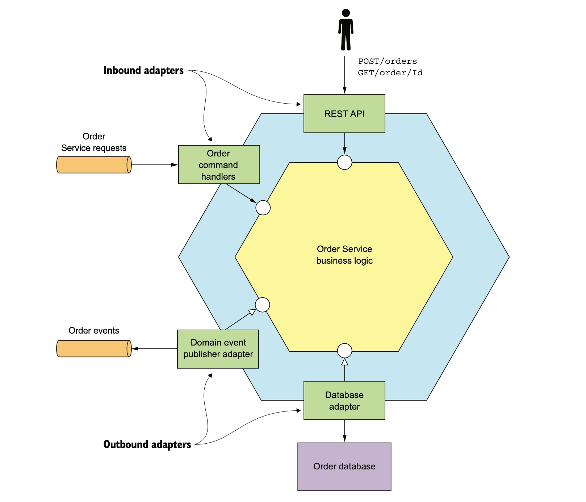

# Hexagonal Architecture

## The idea in one sentence

The business logic (`order-domain` + `order-application`) depends on nothing except itself.
Everything that touches the outside world — HTTP, a database, a message broker — depends on the
business logic instead, through an interface the business logic defines. Reverse that dependency
and you no longer have a hexagonal architecture; you have a layered one with extra interfaces.



## Ports: the business logic defines its own boundary

A **port** is an interface owned by the application layer, written in the application's own
vocabulary. There are two kinds, and the difference is about who calls whom:

- **Input ports** (`order-application/.../port/inbound`) are the operations the application offers to
  the outside world — `IPlaceOrderUseCase`, `IPayOrderUseCase`, `IGetOrderQuery`. Something from
  outside calls *into* these.
- **Output ports** (`order-application/.../port/outbound`) are the capabilities the application needs
  from the outside world — `IEventMessagePublisher`, `IDomainEventPublisher`, `ITransactionRunner`. The
  application calls *out* through these.

Both kinds are interfaces with no implementation and no framework type in their signatures. An
input port doesn't know it will be called from Spring MVC; an output port doesn't know it will be
implemented with JPA. That ignorance is the entire point — it's what makes the application layer
portable.

One output port is a deliberate exception to that package rule: `IOrderRepository` lives in
`order-domain/.../repository`, following DDD's convention that a repository is domain vocabulary —
one per aggregate root — rather than an application concern. It's still implemented outside the
core (`OrderPersistenceAdapter`), so the dependency still points inward; only the interface's
*package* moved, from an application port to a domain-owned contract. `IOrderQueryRepository`
stays under `port/outbound`, because it returns application-level view types for queries, not the
aggregate — it's a CQRS read port, not a DDD repository.

## Adapters: everything outside the ports

An **adapter** is code that sits on one side of a port and translates between the port's
vocabulary and some external technology's vocabulary.

- **Driving adapters** sit on the input side and call a use case. `order-adapter-rest`'s
  `OrderController` is one: it turns an HTTP request into a `PlaceOrderCommand`, calls
  `IPlaceOrderUseCase.placeOrder(...)`, and turns the result back into JSON.
- **Driven adapters** sit on the output side and implement an output port.
  `order-adapter-persistence`'s `OrderPersistenceAdapter` implements `IOrderRepository` with JPA;
  `order-adapter-messaging`'s `LoggingEventMessagePublisher` implements `IEventMessagePublisher`.

Neither kind of adapter calls the other directly, and neither kind knows the other exists. A
driving adapter depends only on input ports; a driven adapter depends only on output ports it
implements. That's what makes them interchangeable: swap `order-adapter-rest` for a gRPC adapter,
or `order-adapter-persistence` for a different store, and nothing on the other side of the
hexagon — not the use cases, not the other adapters — has to change.

## The module graph *is* the enforcement mechanism

The usual risk with "ports and adapters" is that it's a description of intent that nothing
actually checks — a developer in a hurry imports a JPA entity straight into a use case, and the
architecture is now a comment, not a fact. This repo avoids that by making the boundary a Maven
module boundary:

```
order-service
├── order-domain                 ← the hexagon's core. ZERO dependencies.
├── order-application            ← ports (inbound/outbound) + use cases. Depends on: domain.
├── order-adapter-rest           ← driving adapter (HTTP).     Depends on: application.
├── order-adapter-persistence    ← driven adapter (JPA).       Depends on: application.
├── order-adapter-messaging      ← driven adapter (broker).    Depends on: application.
└── order-bootstrap              ← composition root. Depends on: everything.
```

```
        ┌──────────────────── order-bootstrap ────────────────────┐
        │         (the only module that sees the whole thing)     │
        └────────────────────────────────────────────────────────-┘
              │                     │                      │
    ┌─────────▼──────────┐          │           ┌──────────▼──────────┐
    │  adapter-rest      │          │           │  adapter-persistence│
    │  (driving)         │          │           │  adapter-messaging  │
    │  HTTP → input port │          │           │  output port → tech │
    └─────────┬──────────┘          │           │  (driven)           │
              │                     │            └──────────▲──────────┘
              │  calls ↓            │          implements ↑ │
    ┌─────────▼─────────────────────▼──────────────────────┴──────────┐
    │                        order-application                        │
    │   port.inbound (input ports)   ·   port.outbound (output ports) │
    │   usecase (implements port.inbound, calls port.outbound)        │
    └─────────────────────────────┬─────────────────────────────────── ┘
                                  │  uses
                    ┌─────────────▼─────────────┐
                    │        order-domain        │
                    │   the hexagon's core       │
                    └────────────────────────────┘
```

`order-domain/pom.xml` has an empty `<dependencies>` section. `order-application/pom.xml`
depends on nothing but `order-domain`. Those aren't conventions a reviewer has to remember to
check — they're facts Maven enforces: if `order-application` code imports a JPA annotation, the
module fails to compile, because `jakarta.persistence` is not on its classpath. A boundary that
can only be violated by *also* editing a `pom.xml` is a boundary worth trusting.

The three adapter modules each depend only on `order-application`, and on nothing from each other.
That's not incidental — it's what guarantees `order-adapter-rest` could be deleted and replaced
without `order-adapter-persistence` noticing.

Every other module knows only the slice of the hexagon it needs. `order-bootstrap` is the one
module allowed to know about all of them at once, because something has to wire a driving
adapter's calls through to a driven adapter's implementation — and that wiring is itself not
business logic, so it doesn't belong in `order-application`.

## Architecture Test

This repo backs the claim with an
executable check:
[`HexagonalArchitectureTest`](order-bootstrap/src/test/java/com/acme/orders/bootstrap/architecture/HexagonalArchitectureTest.java),
built on ArchUnit, runs as part of `mvn verify` and fails the build if any of the following
becomes false:

- `order-domain` depends on nothing but the JDK.
- `order-application` depends on nothing but `order-domain` and the JDK.
- No class in the domain or application layers imports Spring, Jakarta, Jackson, Hibernate, or
  SLF4J — an annotation from a framework is a dependency on that framework, even if the module
  graph would technically allow importing just the annotation.
- The three adapter modules never depend on one another.
- Spring Data types (`Page`, `Pageable`) never cross a port boundary.
- Every type in `port.inbound`/`port.outbound` is an interface, not a class wearing a port's name.
- Adapters depend on ports, never directly on a `usecase` implementation class.

Where the module graph makes a violation impossible to compile, these rules are redundant by
construction. Where it doesn't — package-level direction inside a module, or a framework
annotation that doesn't require a new Maven dependency — the rules are what catches it. Together,
the module graph and this test are the reason "hexagonal architecture" in this repo is a property
of the build, not a description in a document that drifts the moment nobody's looking.
